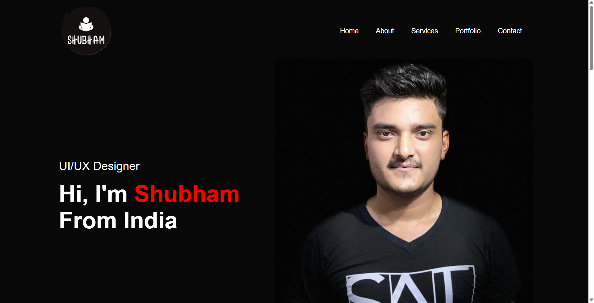
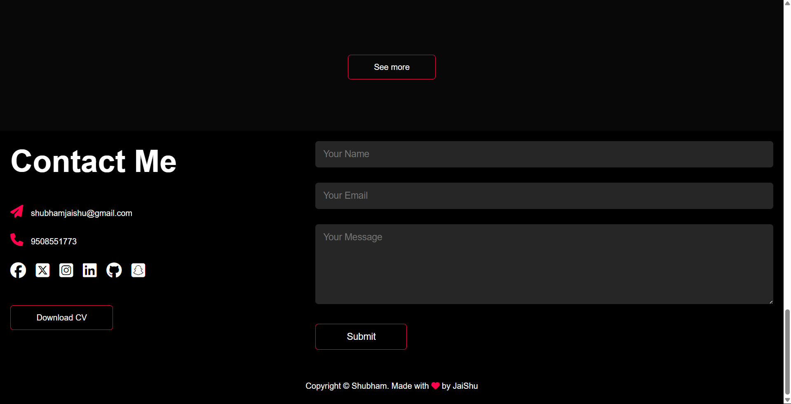

# Portfolio

A lightweight portfolio website built using HTML, CSS, and JavaScript, featuring small and simple animations for a clean and interactive design.

[Live Demo](https://remarkable-nasturtium-11f1af.netlify.app/)

---

## Overview
This project highlights:
- A minimalist and responsive portfolio design.
- Subtle animations to enhance user interaction.
- Smooth navigation and clean layout.

---

## Features
- **Simple Animations:** Lightweight animations for an elegant look.
- **Responsive Design:** Optimized for all screen sizes.
- **Clean and Modern Layout:** Focused on usability and readability.

---

## Technologies Used

### Frontend
- **HTML5:** Structured content.
- **CSS3:** Styling and responsive design.
- **JavaScript:** Adding interactivity and animations.

### Hosting
- Hosted on Netlify: [Live Demo](https://remarkable-nasturtium-11f1af.netlify.app/)

---

## Installation

### Steps
1. Clone the repository:
   ```bash
   git clone https://github.com/shubham-jaishu/Old_Portfolio.git
   ```

2. Navigate to the project directory:
   ```bash
   cd Old_Portfolio
   ```

3. Open the `index.html` file in your browser:
   ```bash
   open index.html
   ```

---

## How It Works
1. **Minimal Animations:** Simple transitions and hover effects for smooth interactions.
2. **Responsive Layout:** Ensures compatibility across devices and screen sizes.
3. **Clean Design:** Focused on highlighting content without distractions.

---

## Preview



---

## Future Improvements
- Add a contact form with email integration.
- Enhance animations for better engagement.
- Include a blog section for content updates.

---

## Contribution
Contributions are welcome! Feel free to fork the repository and submit a pull request.

---

## Contact
For queries or feedback, please contact [Shubham](mailto:shubhamjaishu@gmail.com).
